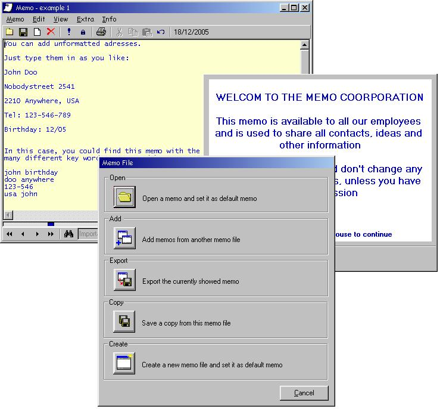



## MEMO v3\.0

### Description

This Memo organizer can do it all! You can store lots of memos in a memo file, use different memo files, import or export memos. You can edit the memos as you like, enter adresses (any kind of format), opening hours, ideas, things to remember or any kind of information. With the - very easy to use - search function, you will be able to find anything in a vast amount of memo information. You can check a memo as important, and on startup, this memo will be shown first. You can lock individual memos for edit. And it gets even better; you can put your memos on a network, and share them. You can open and edit it, and when the memo file is already in use by another user, you are notified as read-only, and you can see who's editing it. You can even ask to be notified if the file is available again for edit. Another feature is the splash screen. If you share a memo, as in your company, you can add a splash screen, welcoming the user, and f.i. warn him to use it properly. I have added two example files, 'example 1.mem' and 'example 2.mem' which show some features. I use this program to share all kinds of practical information with other employees, and the memo file is grown into a really hugh information guide, with an easy search routine. It's in use for about three years, so it's bug free, but i had to translate it into english for PSC, so there might be some translation bugs in it( althoug is doubt it). All comments or feedback most welcome, and since this is my last submission for 2005...Happy Newyear!!!
 
### More Info
 

             |
---                |---
**Submitted On**   |2005-12-17 11:53:38
**By**             |[D\. Rijmenants](https://github.com/Planet-Source-Code/PSCIndex/blob/master/ByAuthor/d-rijmenants.md)
**Level**          |Beginner
**User Rating**    |5.0 (10 globes from 2 users)
**Compatibility**  |VB 5\.0, VB 6\.0
**Category**       |[Miscellaneous](https://github.com/Planet-Source-Code/PSCIndex/blob/master/ByCategory/miscellaneous__1-1.md)
**World**          |[Visual Basic](https://github.com/Planet-Source-Code/PSCIndex/blob/master/ByWorld/visual-basic.md)
**Archive File**   |[MEMO\_v3\_019573912182005\.zip](https://github.com/Planet-Source-Code/d-rijmenants-memo-v3-0__1-63695/archive/master.zip)

